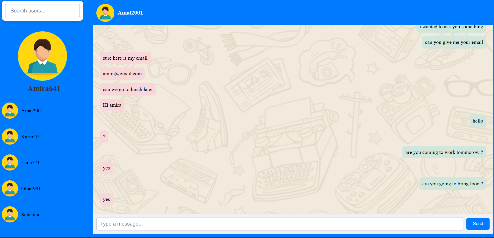
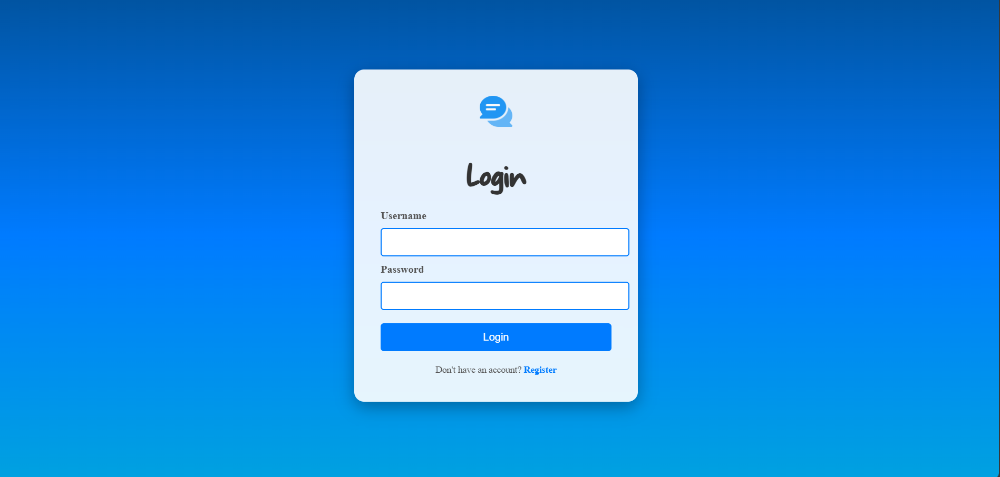
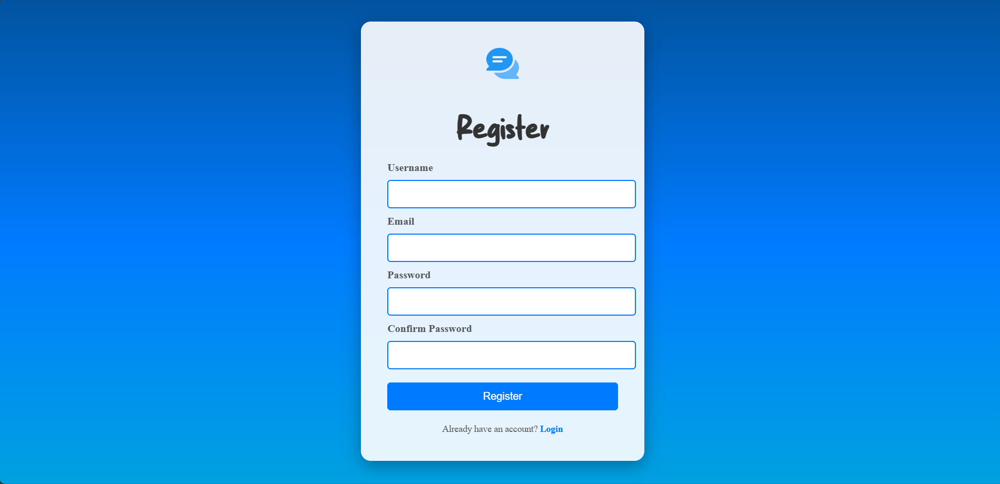
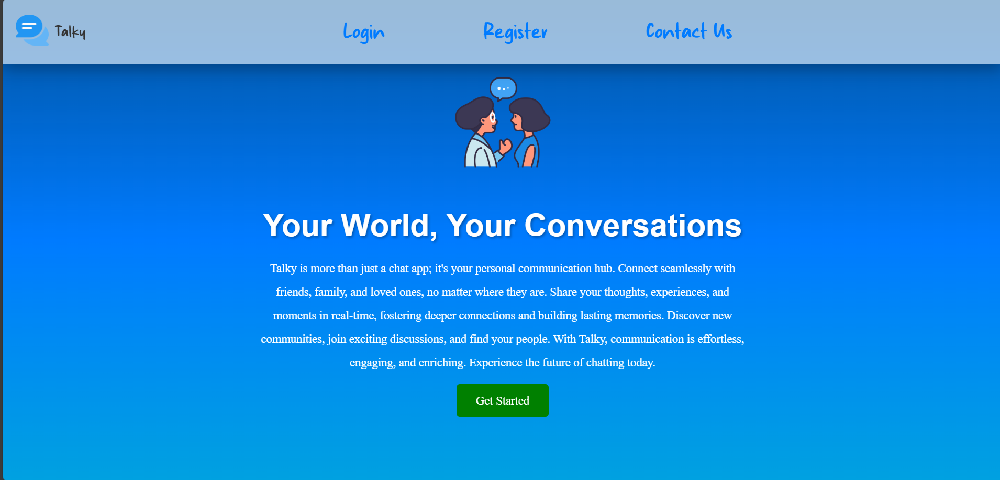

# Talky: A Real-Time Chat Web App

Talky is a dynamic, real-time chat application built with React.js. It provides a seamless platform for users to connect, communicate, and share experiences in real-time.

**his project was created to showcase my skills in web development and the use of React.js for building interactive applications. Please note that this project is not intended for production use and may not be fully complete or maintained.**

